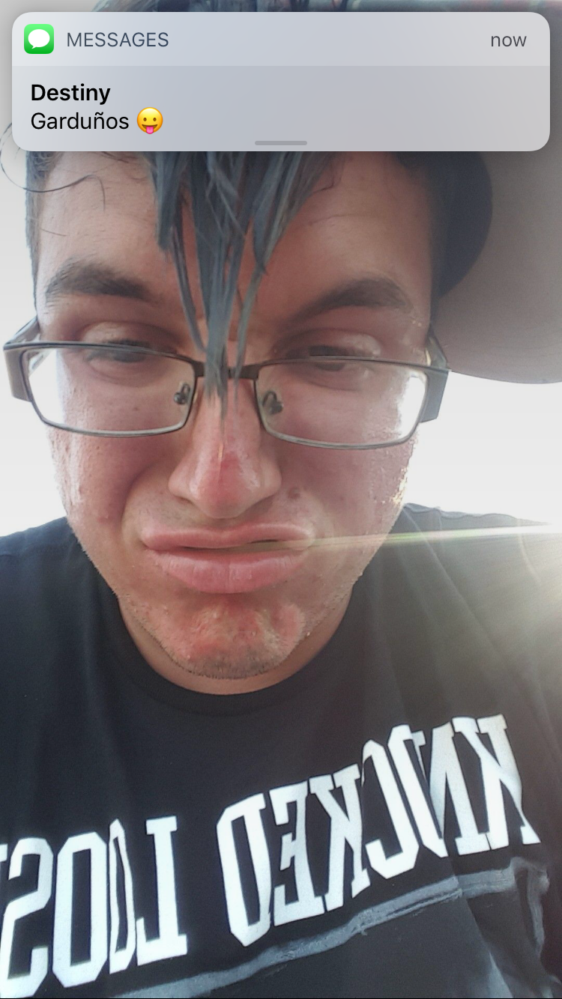

## Start with the pizza head photo

The feature we are focusing on is the fringe: longer pieces fall forward and narrow toward a point in the middle of the forehead. The blue color adds personality, while the separated strands make the shape easy to pick out. That pointed outline is the starting point for our pizza head conversation.

Use this image as a reference when you visit us. Point to the parts you like, whether that is the central point, the longer front, or the separation between strands. A photograph gives us more useful detail than a nickname alone, especially when you want a distinctive look.

## Choose where the fringe should finish

Before deciding how much length to take off, tell us where you want the front to sit when your hair is dry and styled. A point above the eyebrows and a longer piece reaching toward your glasses create different everyday experiences. We want the shape to feel comfortable as well as expressive.

If you wear glasses, bring your usual pair. Show us whether you prefer the fringe to clear the frames, sit near them, or move easily to the side. It also helps to explain whether you like hair on your forehead throughout the day or want the option to brush it back.

## Plan the sides and back separately

This front-facing picture gives us a starting point for the fringe, but it does not show a complete view of the sides and back. Bring another reference for those areas, or tell us how you would like them to look. We can discuss how to connect those choices to the longer front.

Use these details to prepare for your appointment:

- **Front:** Point to the desired endpoint and say how pronounced you want the central point.
- **Sides:** Explain whether you prefer visible length, a softer taper, or a closer finish around the ears.
- **Back:** Choose whether you want to retain length or keep the neckline more compact.
- **Styling:** Tell us how much time you want to spend arranging the fringe each morning.

Our [scissor and clipper guide](/guides/scissor-vs-clipper-cut) can help you describe the finish you prefer. We can then discuss the haircut around your hair's movement and the length you have available.

## Talk about separation, hold, and finish

Describe whether you want a loosely arranged point or a more defined finish. The reference shows separated strands, but a photo alone cannot tell us which product was used. Bring the name of anything you already use and explain what you like about it.

For a softer styling direction, [Prospectors describes its Styling Cream as providing light hold, texture, and a natural shine](https://prospectorspomade.com/products/prospectors-styling-cream). We carry it among our styling options and can discuss whether that finish matches your preference. Light hold is a different goal from keeping a sharply arranged point fixed in place.

## Keep the outline intentional as it grows

Watch where the fringe begins to feel too long for your eyes or frames, and whether the sides still balance the front. Those details are useful when planning your next appointment. Tell us what worked well between visits so we can keep refining the shape with you.

Explore our [men's haircut service](/mens-haircut-richmond-va) when you are ready to book. Bring this picture and any extra angles that explain your idea; our [haircut consultation guide](/guides/how-to-ask-for-a-haircut) offers more ways to make your preferences clear.

## Frequently asked questions

### Do I need blue hair for this look?

We are using the picture to discuss the shape of the fringe. You can bring the same reference to talk about a pointed front while keeping your own hair color.

### Can I ask for pizza head by name?

Yes, and show us this photo alongside the name. Explain which details you want to keep so we can discuss a specific result together.

### Will mine look exactly like the picture?

Your texture, current length, natural growth direction, and styling preferences all belong in the conversation. We will discuss what to preserve and what to adapt so the haircut feels personal to you.
